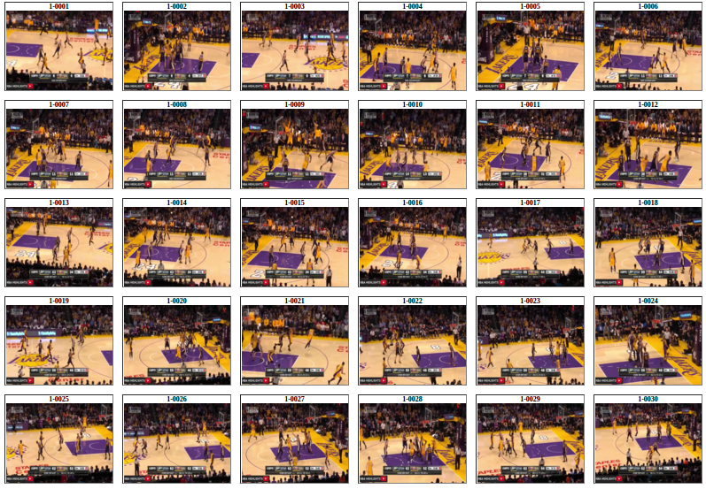
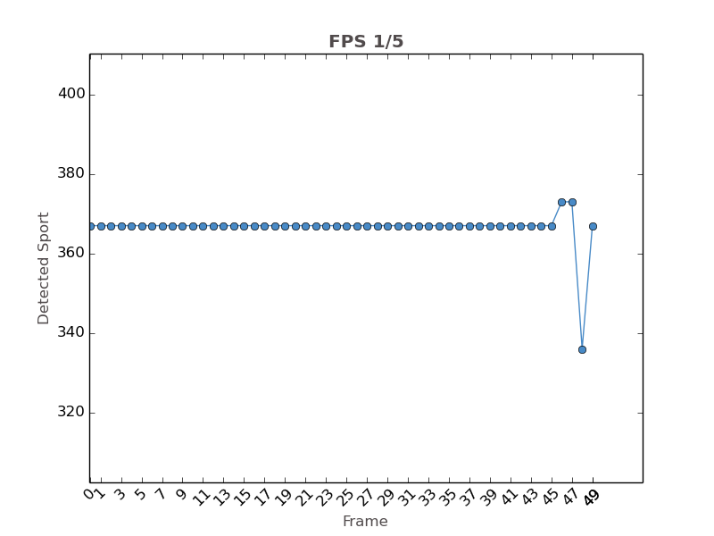
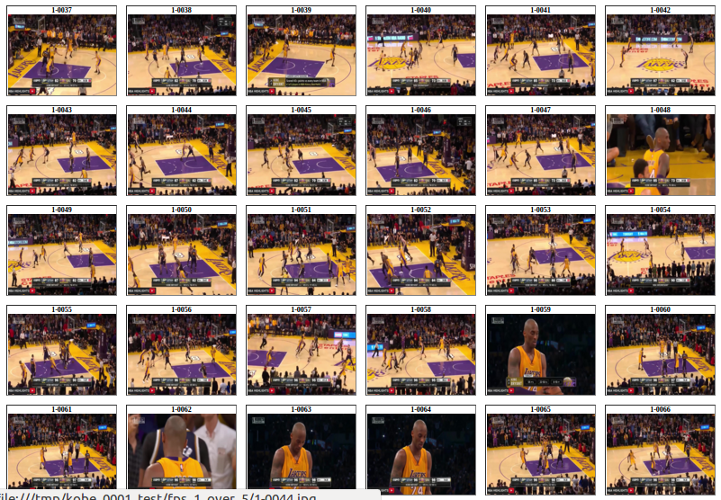
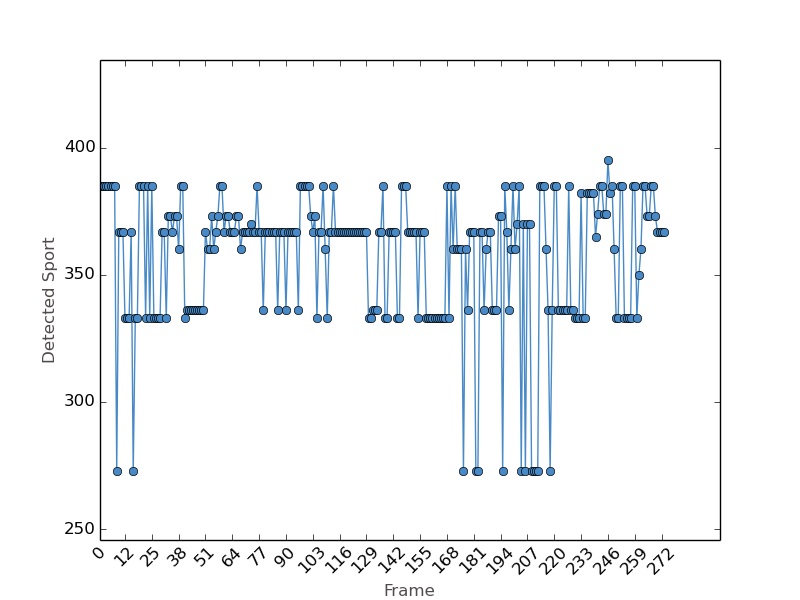
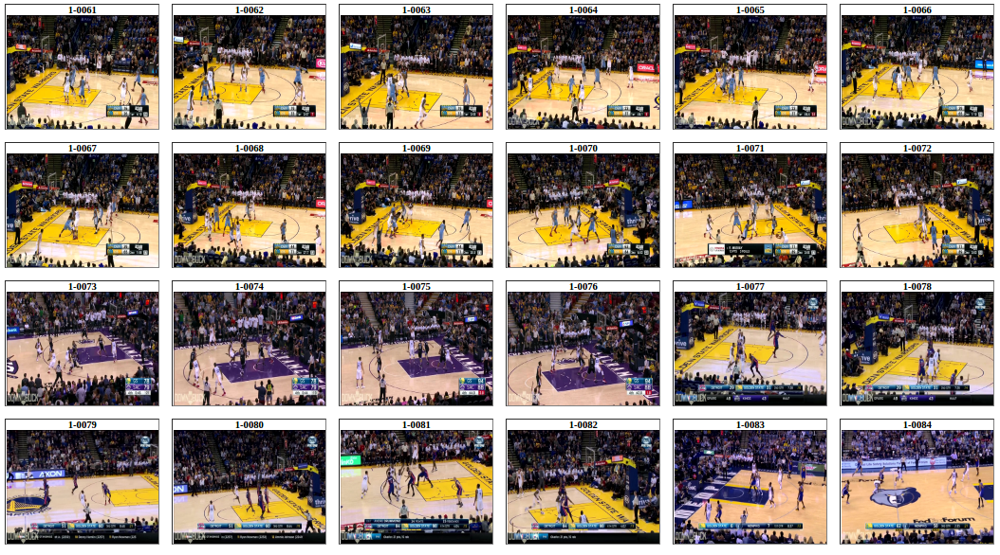

## 深度學習(Deep Learning)超新手入門                                            
                                                                                
### 簡介                                                                        
踏入深度學習這個領域有一陣子了，網路上雖然資源很豐富，但實作相關的中文資料卻少得可憐，提到繁中更是一片沙漠，因次，希望用中文把一些小 tips 分享給「想進入深度學習但還正在摸>索中的超新手們」，讓讀者不用有太深厚的理論背景，看了以後依然馬上就能上手玩一些 pre-trained model。由於深度學習大多的資料都還是英文為主，因此在本篇文章中不會把專有名詞做翻譯，而是保留原文，希望讀者在後續銜接英文資料時比較容易，造成中英夾雜還請多包涵。另外，以 Python 為主除了是個人偏好以外，確實 Python community 也在深度學習割據了大半的領土，對於不是使用 Python 的讀者也說聲抱歉。
* 目標讀者：對深度學習有興趣，但不知如何下手實作                                
* 主要語言：Python                                                              
* Deep Learning Framework: Keras                                                
* 範例 Model: C3D                                                               
* **絕對不推薦看的族群**：                                                      
 * 對 Deep Learning 實作已經有經驗                                              
 * 希望在本篇文章找到更多的理論與數學                                           
                                                                                
### 自學素材推薦                                                                
深度學習實在是一個太廣泛的題目了，本篇文章能涵蓋的只是最淺的皮毛，更多的學習資源請參考[深度學習(Deep Learning)自學素材推薦](http://dt42.github.io/2016/04/27/deep-learning-material-recommendations/)。
                                                                                
### Keras：新手的好朋友                                                         
有一次在網路上逛到這張圖片，覺得相當中肯...。


*因圖片被大量轉載，找不到原始的版權，無法標注，如有侵權的疑慮還請不吝指正
(I saw the image from my friend’s Facebook. If anyone knows where the image is from or the license of it, please let me know)*

除了表達出 Deep Learning 跟大家想的不一樣之外，也點出了對做 Deep Learning 的工程師或者研究者而言，最重要的夥伴之一就是好的 framework。在 Deep Learning 這個領域，Python 的使用者是相當幸福的，有 [Caffe](http://caffe.berkeleyvision.org/), [Theano](http://deeplearning.net/software/theano/
), [Lasagne](https://github.com/Lasagne/Lasagne), [Tensorflow](https://www.tensorflow.org/), 還有一些族繁不及備載的各式選擇。

本文以 [Keras](http://keras.io/) 為範例。Keras 是一個基於 Python 的高階 deep learning framework，高度模組化、容易上手也容易擴展；選 Keras 的原因無他，簡單而已。Keras 的設計理念跟 [Torch](http://torch.ch/) 相當接近，每個 layer 都是一個物件，除了初始維度需要設定以外，其他每一層的 tensor 流動 Keras 都會幫你算好；model 跟 weights 要分兩個檔案儲存，這點與 Tensorflow 或是 Caffe 不太相同。Keras 本身是不處理矩陣運算的，全部交由 backend 處理；目前支援的 backend 有 Theano 以及 Tensorflow。請注意，雖然 Keras 可以選用 Tensorflow 做為 backend，但寫起來的語法是完全不同的，也不能直接拿 Tensorflow 的 model 來套用。如果想學純的 Tensorflow 怎麼使用，Google 有在 Udacity 上提供[線上教材](https://www.udacity.com/course/deep-learning--ud730)。

一般來說，深度學習因為涉及的層面較廣，dependencies 都不會少，如果只是入門想玩玩看，推薦使用 Docker，生活會輕鬆一點。本文的目的是介紹 deep learning 實作，所以省略過環境設定的細節，有需要的讀者可以直接在 Docker Hub 上找到裝好所有 dependencies 的 [Docker image](https://hub.docker.com/r/wanchingy/keras-python2.7/)；目前還是基於 Ubuntu 14.04 設定，未來會升級到 16.04。這個 Docker image 是 CUDA based，如果要使用 GPU 運算，除了本機要安裝 NVIDIA 顯卡的驅動程式跟 CUDA package 以外，還要藉助 [nvidia-docker](https://github.com/NVIDIA/nvidia-docker
)；我之前把編譯好的 [binary]( https://github.com/tammyyang/simdat/blob/devel/docker/nvidia-docker
) 備份在 github 上，理論上是可以使用，但還是建議重新編譯 nvidia-docker 比較保險。

#### 詳細步驟 (以 Ubuntu 14.04 為範例)：
安裝 Docker 並下載 Docker image
```
$sudo apt-get install docker.io
$sudo docker pull wanchingy/keras-python2.7
```
安裝 NVIDIA 驅動程式與 CUDA (以nvidia-352 為例，不需要使用 GPU 運算可以跳過)
```
$sudo apt-get install nvidia-352
$wget http://developer.download.nvidia.com/compute/cuda/repos/ubuntu1404/x86_64/cuda-repo-ubuntu1404_7.5-18_amd64.deb
$sudo dpkg -i cuda-repo-ubuntu1404_7.5-18_amd64.deb
$sudo apt-get update
$sudo apt-get install cuda
```
編譯 nvidia-docker
```
$git clone https://github.com/NVIDIA/nvidia-docker.git
$cd nvidia-docker
$sudo make && make install
```
進入 Docker container 環境
```
$GPU=0 sudo nvidia-docker run -it wanchingy/keras-python2.7 /bin/bash
```

對於不想使用 Docker 的讀者，以下是主要的套件列表
* GPU 運算：NVIDIA CUDA (如果不打算使用 GPU 運算可以跳過)
* Python 套件：numpy, scipy, h5py
* 影像處理：OpenCV
* Deep Learning Framework：Keras
* Backend：Theano (想嘗試 Tensorflow 的讀者可以直接改執行 `KERAS_BACKEND=tensorflow`)

### Train? Pre-train?
眾所皆知，深度學習除了好的模型還需要巨量的資料，才能讓機器有好的學習成果。很不巧的是，一般市井小民的我們，除了沒有資料，更沒有能訓練(train)如此大量資料的機器。難道一切就結束了嗎...？當然不是！此時 pre-trained model 就要登場了。所謂的 pre-trained model 是利用大量資料、曠日費時、同時還耗費很多電費、造成全球暖化，所訓練出來的模型，一般深度學習的 pre-trained model 參數量隨便都在千萬以上。我們可以把它們想成兩歲的小孩，不僅看得懂簡單的物體，也能分辨基本的形狀、線條等等。身為窮困的市井小民，我們要做的就是儘量利用這些 pre-trained models，如果運氣很好，pre-trained model 已經看得懂你的目標物，恭喜！看完這篇文章之後就可以實作出來了。但如果運氣差一點，pre-trained model 還看不懂你打算辨識的物體，也沒關係，再經過一點資料做 fine tune，讓兩歲小孩成長成三歲，就可以進一步辨識更多物體了。本文會先著重在 pre-trained model 最基本的使用，fine-tune 的部份未來會再用另外一篇文章介紹。 

使用 Keras 來跑 pre-trained model 的時候，我們需要兩個檔案：model 與 weights；前者敘述了 model 的架構，可以是 yaml 或者 json 的格式，而後者以 hdf5 格式儲存了 pre-trained model 的參數。

### C3D Model：他在打籃球

C3D 是一個基於 **Sports1M** 資料庫的 3D convolutional pre-trained model，它加入了時間的維度，讓運動項目的識別變得更精準；除了辨識影片中的運動項目，這個 pre-train model 的用途還有很多，配合上 linear SVM 也可以做 scene classification。原本的 model 是基於 caffe 訓練出來的，論文請參考[1]( http://arxiv.org/pdf/1412.0767v4.pdf)。[Alberto Montes](https://gist.github.com/albertomontesg/d8b21a179c1e6cca0480ebdf292c34d2) 不僅展示了如何將 caffe 的 model 轉換到 Keras ，同時也把轉換後 Keras 可讀的 model [json 檔](https://gist.githubusercontent.com/albertomontesg/d8b21a179c1e6cca0480ebdf292c34d2/raw/1e2620258ce619e18d3219cf962a3f0a0ed17093/sports_1M.json)與 [hdf5 weights](https://drive.google.com/open?id=0BzmDUR5_3US0V1hjV3VvREJ3NGs) 直接分享出來；本文使用的原始碼亦大量參考了 Alberto Montes 的文章。

接下來，讓我們用 C3D 對影片內容進行辨識，看它是否能正確回答，測試影片為 [Kobe Bryant 職業生涯最後一場比賽的精華片段](https://www.youtube.com/watch?v=EzpsyFvz7W0)。

由於 C3D 定義每 16 個 frames 為一個 clip data，你可以直接把整個影片用 OpenCV 讀進來，或是用 ffmpeg 自訂 FPS，切割好了以後再送進 C3D 做辨識，範例程式採用的是後者，如果你想要直接讀進影片不預先切割， Alberto Montes 提供了完整的[範例](https://gist.github.com/albertomontesg/d8b21a179c1e6cca0480ebdf292c34d2
)。

#### 詳細步驟 (假設前述的環境設定已完成)：

假設目標影片為`VIDEO_0001.mp4`，為了減少運算量，利用 `ffmpeg`每 5 秒鐘切一個 frame 
```
$ffmpeg -i VIDEO_0001.mp4 -vf fps=1/5 -qscale:v 2 image-%04d.jpg
$mkdir images
$mv image-*.jpg images
```
切出來的圖片大概像這樣



接下來，把 model 跟 weights 都下載至`C3D`的資料夾。其中 weights 的部份請手動點擊 Alberto Montes 所提供的 Google Driver [link](https://drive.google.com/open?id=0BzmDUR5_3US0V1hjV3VvREJ3NGs).
```
$mkdir C3D
$mv sports1M_weights.h5 C3D/weights.h5
$wget https://gist.githubusercontent.com/albertomontesg/d8b21a179c1e6cca0480ebdf292c34d2/raw/1e2620258ce619e18d3219cf962a3f0a0ed17093/sports_1M.json C3D/model.json
```
下載範例程式 [demo_C3D.py](https://github.com/tammyyang/simdat/blob/devel/examples/demo_C3D_2.py) 開始辨識！

```
$KERAS_BACKEND=theano THEANO_FLAGS=exception_verbosity=high,device=gpu,floatX=float32 python demo_C3D_2.py --model-loc="./C3D" --path="./images"
```
首先程式會印出 C3D model 的結構如下

|Layer (name)        |         Output Shape   |               Param # |
|--------------------|:------------------------:||
|Initial input shape:| (None, 3, 16, 112, 112)||
|Convolution3D (conv1) |        (None, 64, 16, 112, 112)   |   5248                |
|MaxPooling3D (pool1)       |   (None, 64, 16, 56, 56)    |    0                   |
|Convolution3D (conv2)    |     (None, 128, 16, 56, 56)    |   221312  |            
|MaxPooling3D (pool2)     |     (None, 128, 8, 28, 28)       | 0 |                  
| Convolution3D (conv3a)   |     (None, 256, 8, 28, 28)    |    884992              |
|Convolution3D (conv3b)  |      (None, 256, 8, 28, 28)      |  1769728     |    
|MaxPooling3D (pool3)       |   (None, 256, 4, 14, 14)      |  0      |             
| Convolution3D (conv4a)   |     (None, 512, 4, 14, 14)     |   3539456             |
| Convolution3D (conv4b)   |     (None, 512, 4, 14, 14)     |   7078400             |
|MaxPooling3D (pool4)       |   (None, 512, 2, 7, 7)          |0                   |
|Convolution3D (conv5a)    |    (None, 512, 2, 7, 7)          |7078400       |      
|Convolution3D (conv5b)    |    (None, 512, 2, 7, 7)          |7078400        |     
|ZeroPadding3D (zeropadding3d) | (None, 512, 2, 9, 9)   |       0             |      
|MaxPooling3D (pool5)    |      (None, 512, 1, 4, 4)         | 0                   |
|Flatten (flatten)        |     (None, 8192)                |  0                   |
|Dense (fc6)               |    (None, 4096)                |  33558528      |      
|Dropout (dropout)      |       (None, 4096)            |      0                 |  
|Dense (fc7)                |   (None, 4096)                |  16781312        |    
|Dropout (dropout)       |      (None, 4096)             |     0                   |
|Dense (fc8)                 |  (None, 487)                  | 1995239            | 
|Total params:  |79991015| |

由於 Keras 不需要每一層都定義 input/output 的 size，而是由 layer 本身的結構與上一層的 output 來決定。像這樣的 summary 對於檢查 model 的結構是否正確相當有用。

除了 model 的結構，程式也給出了辨識結果
```
{336: 'beach handball', 373: 'slamball', 367: 'basketball'}
```
如果把每一個 frame 的結果都畫出來，會得到以下的分佈

從分佈圖會發現，前面的辨識很準確，但最後 4 個 frames 跑出了不同的結果。再對照後半 frame 的截圖

，會發現 C3D 把含有罰球的畫面辨識成了沙灘排球 (beach handball) 與灌籃球 (slamball)，似乎也不是太不合理。

一切看起來很美好，讓我們用 C3D 再看一段超級明星 Stephen Curry 的[精彩畫面剪輯](https://www.youtube.com/watch?v=xVRKTpGTn44)，結果卻不甚理想...

```
{385: 'beach soccer', 360: 'beach volleyball', 395: 'canadian football', 333: 'team handball', 367: 'basketball', 336: 'beach handball', 273: 'freestyle motocross', 370: 'streetball', 350: 'roller hockey (quad)', 373: 'slamball', 374: 'kickball', 365: 'ultimate (sport)', 382: 'softball'}
```


讓我們挑出辨識結果特別好的 frames (61-84)

與辨識結果特別不好的 frames (217-240)

再跟前面針對 Kobe Bryant 影片所得到的結果比較可知，不同場地顏色的變動，對辨識結果產生了影響。從人類的眼光看來，不管是單一比賽、或是多場比賽的剪輯，我們都能輕易知道這是一部籃球比賽的影片；但對 C3D 模型而言，卻不是這麼簡單的事。想要解決這個問題，建立一個針對籃球比賽的模型，讓單一比賽或者多場比賽剪輯都能被精準地分辨出來，可以透過收集資料來 fine-tune C3D即可。

#### 小結
由 C3D 的範例可知，雖然深度學習在大型資料庫上的測試往往表現優異，準確率動輒超過 80% 以上，但如果待解決的問題定義不清楚，就可能帶來很大的傷害。

### 後記
上面所介紹的實作範例只能算是深度學習的入門準備，在進一步研究或是把這些 models 商品化以前，大師 [Yann LeCun 的專訪](http://buzzorange.com/techorange/2015/02/26/facebook-ai-yann-lecun/)相當值得一看。經過了長久的發展，深度學習終於渡過了寒冬開出了小花。但它不是萬能仙丹，能紮實地了解其背後的運作原理與限制，才能善用深度學習開發出好的商品。

[1] http://arxiv.org/pdf/1412.0767v4.pdf
